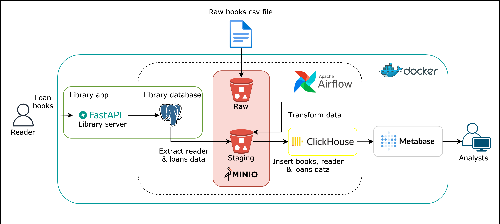

# Books and Rec
A data engineering project.

## Architecture

## Setting up
1. Create a folder `dataset` in the root directory
1. Download the dataset [here](https://www.kaggle.com/datasets/jealousleopard/goodreadsbooks/) into the `dataset` folder
1. Run `python -m venv venv` to create a virtual environment
1. Run `python scripts/library_db_data.py`
